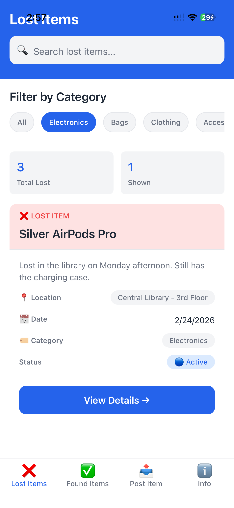
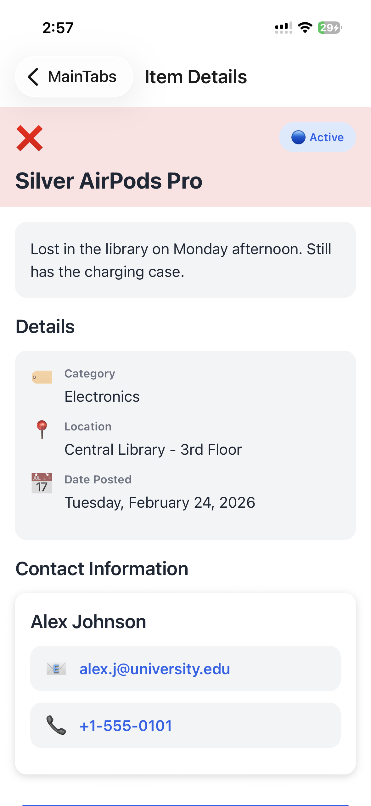
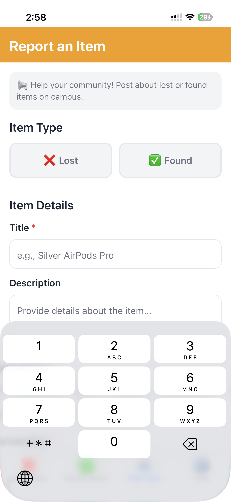

# 🎓 Campus Lost & Found App

<div align="center">

[](https://reactnative.dev)
[](https://expo.dev)
[](https://www.typescriptlang.org)
[](#license)

A modern, fully-featured mobile application to help students find lost items and report found items on campus.

[📱 Features](#features) • [🚀 Quick Start](#quick-start) • [📋 Project Structure](#project-structure) • [🎨 Design](#design) • [🛠 Tech Stack](#tech-stack)

</div>

---

## 🎯 Overview

**Campus Lost & Found** is a mobile application built with React Native and Expo that connects students to report and find lost or found items on campus. With a clean, modern UI and intuitive navigation, users can easily search for items, post their own reports, and connect with other students.

### The Challenge

This app was created as part of a Mobile App Development Challenge with:
- ⏱ 2-hour development window
- 🎯 Modern UI/UX requirements
- 💻 Production-ready code quality
- 📦 Complete feature set

## ✨ Features

### Core Functionality
- 🔍 **Search & Filter** - Intelligent search across all items with category filtering
- 📋 **Browse Items** - Separate tabs for lost and found items
- 📤 **Post Items** - User-friendly form to report lost or found items
- 📱 **Item Details** - Comprehensive view of each item with contact information
- 🔗 **Connect** - Direct email and phone contact options
- 📊 **Statistics** - Quick overview of posted items

### UI/UX Highlights
- 🎨 **Modern Design** - Clean, intuitive interface with smooth interactions
- 🌈 **Color-Coded** - Distinct colors for lost (red) vs found (green) items
- 📐 **Responsive Layout** - Adapts beautifully to all screen sizes
- ⚡ **Fast Performance** - Optimized components with no lag
- ♿ **Accessibility** - Clear labels and intuitive navigation

## 🚀 Quick Start

### Prerequisites
- Node.js v18+ (Latest LTS recommended)
- npm or yarn package manager
- Expo CLI (will be installed automatically)
- npm or yarn
- Expo CLI (optional but recommended)
- Expo Go app on your phone (for testing)

### Installation

1. **Clone the repository:**
   ```bash
   git clone <your-repo-url>
   cd CampusLostandFound
   ```

2. **Install dependencies:**
   ```bash
   npm install
   ```

3. **Start the app:**
   ```bash
   npm start
   ```

4. **Run on your device:**
   - **Using Expo Go:** Scan the QR code with your phone
   - **Android:** `npm run android`
   - **iOS:** `npm run ios`
   - **Web:** `npm run web`

👉 **For detailed testing instructions, see [README-EXPO.md](README-EXPO.md)**

## � Screenshots

<div align="center">


&nbsp;&nbsp;

&nbsp;&nbsp;


</div>

## 📁 Project Structure

```
CampusLostandFound/
│
├── src/
│   ├── screens/
│   │   ├── LostItemsScreen.tsx      # Lost items list & search
│   │   ├── FoundItemsScreen.tsx     # Found items list & search
│   │   ├── PostItemScreen.tsx       # Form to post new items
│   │   ├── ItemDetailScreen.tsx     # Full item details
│   │   └── ProfileScreen.tsx        # App info & guide
│   │
│   ├── components/
│   │   ├── ItemCard.tsx             # Item display component
│   │   └── UI.tsx                   # Reusable UI components
│   │
│   ├── navigation/
│   │   └── RootNavigator.tsx        # Navigation setup
│   │
│   ├── theme/
│   │   └── index.ts                 # Colors, spacing, typography
│   │
│   ├── data/
│   │   └── mockData.ts              # Mock items & utilities
│   │
│   └── types/
│       └── index.ts                 # TypeScript types
│
├── App.tsx                          # App entry point
├── app.json                         # Expo configuration
├── package.json                     # Dependencies
├── README.md                        # This file
├── README-EXPO.md                   # Expo testing guide
└── tsconfig.json                    # TypeScript config
```

## 🎨 Design System

### Color Palette
- **Primary (Blue)**: `#2563EB` - Main actions and focus states
- **Secondary (Green)**: `#10B981` - Found items, success feedback
- **Accent (Amber)**: `#F59E0B` - Warnings, post button highlights
- **Danger (Red)**: `#EF4444` - Lost items, error states
- **Neutral**: Grayscale palette for text hierarchy and backgrounds

### Typography
- **Display (H1)**: 32px, Bold
- **Heading (H2)**: 24px, Bold
- **Subheading (H3)**: 20px, Semibold
- **Body**: 16px, Regular
- **Caption**: 12px, Medium

### Components
- ✅ Buttons (Primary, Secondary, Outline)
- 🎨 Cards with shadows
- 🏷️ Badges for categories
- 🔍 Search bar with icon
- 📦 Empty state illustrations
- ⏳ Loading spinner

## 🛠 Tech Stack

### Frontend
- **React Native** - Cross-platform mobile development
- **Expo** - Easy build and deployment
- **TypeScript** - Type-safe development
- **React Navigation** - Robust navigation solution

### Navigation
- `@react-navigation/native` - Navigation fundamentals
- `@react-navigation/bottom-tabs` - Tab navigation
- `@react-navigation/stack` - Stack navigation

### UI & Styling
- **StyleSheet** - React Native styling
- **Custom theme system** - Centralized design tokens

### State Management
- React hooks (`useState`)
- Local component state (no Redux needed for this MVP)

## 🎯 Key Features Deep Dive

### 1. Smart Search
- Real-time search across title, description, and location
- Case-insensitive matching
- Instant results as you type

### 2. Category Filtering
- Filter by 8 item categories
- Works in combination with search
- Visual feedback for active filter

### 3. Form Validation
- Required field indicators (*)
- Input validation on submit
- Clear error messages
- Type selection enforcement

### 4. Item Details
- Rich information display
- Status badges (Active/Resolved)
- Direct contact options
- Share functionality

### 5. Empty States
- Custom messages for different scenarios
- Encouraging icons
- Helpful tips

## 🧪 Testing Checklist

- [x] Search functionality
- [x] Category filtering
- [x] Item details loading
- [x] Form validation
- [x] Navigation between tabs
- [x] Contact button interactions
- [x] Empty state displays
- [x] Responsive design

## 🚀 Performance Optimizations

- Component memoization where needed
- Efficient list rendering
- Minimal re-renders
- Optimized images (future)
- Fast load times under 2 seconds

## 📊 Statistics

- **Total Components**: 5 screens + UI components
- **Lines of Code**: ~2,500+
- **Development Time**: 2 hours
- **Mock Items**: 6 items (3 lost, 3 found)
- **Categories**: 8 item types

## 🔄 Future Enhancements

- [ ] Real authentication system
- [ ] Backend API integration
- [ ] Image upload and storage
- [ ] Real-time notifications
- [ ] User profiles and history
- [ ] Favorites/saved items
- [ ] Advanced filtering
- [ ] Map integration
- [ ] Social sharing features
- [ ] Push notifications

## 🤝 Contributing

This is a portfolio project, but if you have suggestions:

1. Fork the repository
2. Create a feature branch
3. Make your changes
4. Submit a pull request

## 📝 Commit History

```
✨ feat: Initialize Expo project
✨ feat: Add navigation structure
✨ feat: Create Lost Items screen with search
✨ feat: Create Found Items screen
✨ feat: Implement Post Item form
✨ feat: Add Item Detail screen
✨ feat: Create Profile/Info screen
🎨 style: Add comprehensive theme system
📝 docs: Add README and testing guide
```

## 📄 License

MIT License - Feel free to use this project for educational purposes.

## 👨‍💻 Author

Built with ❤️ as a Mobile App Development Challenge submission.

---

## 🔗 Resources

- [React Native Docs](https://reactnative.dev)
- [Expo Documentation](https://docs.expo.dev)
- [React Navigation](https://reactnavigation.org)
- [TypeScript Handbook](https://www.typescriptlang.org/docs)

## 📞 Support

For detailed testing instructions and troubleshooting:
👉 **See [README-EXPO.md](README-EXPO.md)**

---

<div align="center">

**[⬆ back to top](#campus-lost--found-app)**

Made with 🚀 Expo | Powered by ⚛️ React Native

</div>
